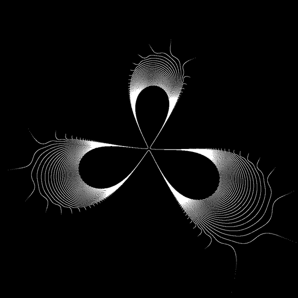

#TOC
* Intro
* images
* algorithms
* functions
* results
* Licence
* Technical notes


# Intro	

sequence of parabolic points on the boundary of main cardioid tending to 1/3 

see also :
* [wikibooks](https://en.wikibooks.org/wiki/Fractals/Mathematics/sequences#sequence_of_parabolic_points_on_the_boundary_of_main_cardioid)
* [definition of critical orbit ](https://en.wikibooks.org/wiki/Fractals/Iterations_in_the_complex_plane/def_cqp#Critical_2)
* [images of critical orbit from commons](https://commons.wikimedia.org/wiki/Category:Critical_orbits)
* [Repelling and attracting directions](https://en.wikibooks.org/wiki/Fractals/Iterations_in_the_complex_plane/r_a_directions)


# Images
Names: n_{i_Max_multiplier}.png


  

Image above is 7_10000.png. It means:
* n=7 
* i_Max_multiplier = 10 000
* number of point on the image is i_Max = iPeriodChild*i_Max_multiplier = q*i_Max_multiplier = 10 000 000 * 10 000 = 100 000 000 = 10^8


# algorithms
* creating image
* finding parameter c
* critical orbit = forward iteration of critical point


## creating images

There are :
* virtual 2D array with integer coordinate ix and iy
* memory 1D array with integer coordinate, which contains color of the pixel (8 bit color = shades of gray) 
* rectangle of dynamic complex plane with complex coordinate z ( world or complex double coordinate)
* pgm graphic file on the disc 


transformations:
* world to screen: z -> (ix,iy) -> i


## critical orbit
Critical orbit has a form of q-arm deformed star. To end drawing with similar distance to fixed point the number of points to draw ( i_Max) is proportional to number of arms q: 

```c
iPeriodChild = q; 
i_Max = iPeriodChild*i_Max_multiplier;
```


# functions

## Give_t
t is:
* internal angle or rotational number
* measured in turns ( proper fraction )

$`t = \sum_{ k \mathop =1}^n \frac{3}{10^k}`$


```c
double Give_t(int nMax){

	double t = 0.0; // = p/q 
	// ratio
	long long  int p = 3; // numerator of t
	long long int q = 10; // denominator of t
	
	int n = 1;
	
	
	// bounds check 
	if (nMax < 1) {printf(" error nMax < 1 \n"); return t;}
	if (nMax > 20) {printf(" error nMax > 20 \n"); return t;}
	
	while ( n< nMax){
		
		p = p + 3*q;
		q = q*10;
		n++;
	
	
	}
	 
	t = (double)p/q; // compute floating point value 
	printf( "for n = %2d  p/q = %18Ld / %18Ld  \tt =  %.16f \n",n, p, q, t); 
	
	
	return t; 
}

```


Results:

```bash
for n =  1  p/q =                  3 /                 10  	t =  0.3000000000000000 
for n =  2  p/q =                 33 /                100  	t =  0.3300000000000000 
for n =  3  p/q =                333 /               1000  	t =  0.3330000000000000 
for n =  4  p/q =               3333 /              10000  	t =  0.3333000000000000 
for n =  5  p/q =              33333 /             100000  	t =  0.3333300000000000 
for n =  6  p/q =             333333 /            1000000  	t =  0.3333330000000000 
for n =  7  p/q =            3333333 /           10000000  	t =  0.3333333000000000 
for n =  8  p/q =           33333333 /          100000000  	t =  0.3333333300000000 
for n =  9  p/q =          333333333 /         1000000000  	t =  0.3333333330000000 
for n = 10  p/q =         3333333333 /        10000000000  	t =  0.3333333333000000 
for n = 11  p/q =        33333333333 /       100000000000  	t =  0.3333333333300000 
for n = 12  p/q =       333333333333 /      1000000000000  	t =  0.3333333333330000 
for n = 13  p/q =      3333333333333 /     10000000000000  	t =  0.3333333333333000 
for n = 14  p/q =     33333333333333 /    100000000000000  	t =  0.3333333333333300 
for n = 15  p/q =    333333333333333 /   1000000000000000  	t =  0.3333333333333330 
for n = 16  p/q =   3333333333333333 /  10000000000000000  	t =  0.3333333333333333 

```


## Give_c


```c

/* computes c on the boundary of Main cardioid of Mandelbrot set */
complex double Give_c(  double InternalAngleInTurns )
{
  
  complex double w;
  complex double c; 
  
  
  double InternalRadius = 1.0; // only boundary points
  
  double t = InternalAngleInTurns *twopi; // from turns to radians
  w = InternalRadius*cexp(I*t); // point of the unit circle 
  
  // main cardioid
  c = w/2 - w*w/4;
  printf("\tc = (%+.16f ; %+.16f)\n",creal(c), cimag(c)); 

  return c;
}


```

Results: 

```bash
for n =  1  p/q =                  3 /                 10  	t =  0.3000000000000000		c = (+0.0477457514062632 ; +0.6224745712206950)
for n =  2  p/q =                 33 /                100  	t =  0.3300000000000000		c = (-0.1069201383061086 ; +0.6492353213974356)
for n =  3  p/q =                333 /               1000  	t =  0.3330000000000000		c = (-0.1231867522608051 ; +0.6495162048804539)
for n =  4  p/q =               3333 /              10000  	t =  0.3333000000000000		c = (-0.1248186255500050 ; +0.6495190243483838)
for n =  5  p/q =              33333 /             100000  	t =  0.3333300000000000		c = (-0.1249818620611921 ; +0.6495190525534192)
for n =  6  p/q =             333333 /            1000000  	t =  0.3333330000000000		c = (-0.1249981862011840 ; +0.6495190528354798)
for n =  7  p/q =            3333333 /           10000000  	t =  0.3333333000000000		c = (-0.1249998186200689 ; +0.6495190528383005)
for n =  8  p/q =           33333333 /          100000000  	t =  0.3333333300000000		c = (-0.1249999818620062 ; +0.6495190528383288)
for n =  9  p/q =          333333333 /         1000000000  	t =  0.3333333330000000		c = (-0.1249999981862006 ; +0.6495190528383290)
for n = 10  p/q =         3333333333 /        10000000000  	t =  0.3333333333000000		c = (-0.1249999998186198 ; +0.6495190528383290)
for n = 11  p/q =        33333333333 /       100000000000  	t =  0.3333333333300000		c = (-0.1249999999818616 ; +0.6495190528383289)
for n = 12  p/q =       333333333333 /      1000000000000  	t =  0.3333333333330000		c = (-0.1249999999981865 ; +0.6495190528383290)
for n = 13  p/q =      3333333333333 /     10000000000000  	t =  0.3333333333333000		c = (-0.1249999999998187 ; +0.6495190528383290)
for n = 14  p/q =     33333333333333 /    100000000000000  	t =  0.3333333333333300		c = (-0.1249999999999818 ; +0.6495190528383290)
for n = 15  p/q =    333333333333333 /   1000000000000000  	t =  0.3333333333333330		c = (-0.1249999999999979 ; +0.6495190528383290)
for n = 16  p/q =   3333333333333333 /  10000000000000000  	t =  0.3333333333333333		c = (-0.1249999999999998 ; +0.6495190528383290)

```


# results

## precision
* double is sufficient for computing t and c up to n = 16
* double is sufficient for drawing n from 1 to 7 and fails for drawing n= 8 and above ( see errors section)


## time


|        n| period | time|
|--------:| --------: | --------: |
|      1  |    10| |
|      2  |    100| | 
|      3  | 1000| |


Time ( for periods 1-7) is proportional to i_Max_multiplier : 


| i_Max_multiplier | time(1-7)|
|        --------: |--------: |
|                1 |      0m00| 
|               10 |      0m20| 
|              100 |      0m27| 
|             1000 |      4m45|
|            10000 |     47m00|


## errors
* for i_Max_multiplier = 1 ther are no errors
* for i_Max_multiplier = 10 there is 1 error: for n =  9 error from  PlotPoint function : point z =  (-0.4365786152835205 ; -0.1839796132996155) is out of drawing rectangle ;  error from DrawCriticalOrbit for i = 999999998 
* for i_Max_multiplier = 100 there are 2 errors: above and for n =  8 error from  PlotPoint function : point z =  (+0.2509611384621441 ; +0.1911010034353226) is out of drawing rectangle; error from DrawCriticalOrbit for i = 199999993 
* for i_Max_multiplier = 1000 there are 2 errors: the same as above
* for i_Max_multiplier = 10000 there are 2 errors: the same as above


Solutions:
* use higher precision ( long double, quad double, arbitrary )


# License

This project is licensed under the  Creative Commons Attribution-ShareAlike 4.0 International License - see the [LICENSE.md](LICENSE.md) file for details  


# technical notes

It is file in a Markdown format ( extension md )

GitLab uses:
* the Redcarpet Ruby library for [Markdown processing](https://gitlab.com/gitlab-org/gitlab-ce/blob/master/doc/user/markdown.md)
* KaTeX to render [math written with the LaTeX syntax](https://gitlab.com/gitlab-org/gitlab-ce/blob/master/doc/user/markdown.md), but [only subset](https://khan.github.io/KaTeX/function-support.html)


## Git
```
cd existing_folder
git init
git remote add origin git@gitlab.com:adammajewski/sequence_of_parabolic_points_on_the_boundary_of_main_cardioid_3.git
git add .
git commit -m "Initial commit"
git push -u origin master
```
