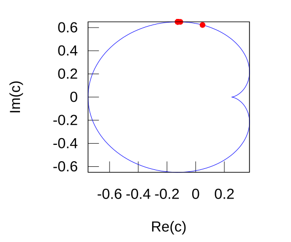

Parabolic critical orbits of [complex quadratic polynomial](https://en.wikipedia.org/wiki/Complex_quadratic_polynomial) for the sequence of rotation numbers tending to 1/3, with periods : 10, 100, 1000, ..., 10^n


# TOC
* [images](README.md#images)
* [algorithms](README.md#algorithms)
* [functions](README.md#functions)
* [results](README.md#results)
* files
* [Licence](README.md#licence)
* [Technical notes](README.md#technical-notes)


# Images

Images of the parabolic critical orbits of [complex quadratic polynomial](https://en.wikipedia.org/wiki/Complex_quadratic_polynomial)

period = 10^1 = 10 , t = 3/10  
  

period = 10^2 = 100   

  

period = 10^3 = 1000  
  

period = 10^4 = 10000  
  

  

  


## How to read image name ?

Names: n_{i_Max_multiplier}.png

See c code :

```c
 snprintf(name, sizeof name, "%d_%Ld", n, i_Max_multiplier); /*  */
 ```


Image above is 7_10000.png. From it's name one can read:
* n=7 
* i_Max_multiplier = 10 000 = 10^4
* number of arms is iPeriodChild = q = 10 000 000 = 10^7

so  number of point on the image i_Max is 

i_Max =  10^4 * 10^7 = 100 000 000 000 = 10^11


Image above is 7_100000.png. From it's name one can read:
* n=7 
* i_Max_multiplier = 100 000 = 10^5
* number of arms is iPeriodChild = q = 10 000 000 = 10^7

so  number of point on the image i_Max is 

i_Max =  10^5 * 10^7 = 1 000 000 000 000 = 10^12


    


Image above is 7_1000000.png. From it's name one can read:
* n=7 
* i_Max_multiplier = 1000 000 = 10^6
* number of arms is iPeriodChild = q = 10 000 000 = 10^7

so  number of point on the image i_Max is 

i_Max =  10^6 * 10^7 = 10 000 000 000 000 = 10^13


	


# Basic facts
* [the evolution function]() of the discrete dynamical system is complex quadratic polynomial $`f_c(z) = z^2 + c `$
* critical orbit is the forward orbit of the critical point $`z = 0`$ 
* critical orbit determines the structure of filled Julia set
* structure of critical orbit is determined by the rotational number ( internal angle) t, its value and type  


## Sequences
* sequence of [rational proper fractions t](README.md#give_t) ( on the real axis )
* sequence of [parabolic points c](README.md#give_c) on the boundary of main cardioid tending to 1/3 ( on the parameter plane)
* sequence of critical orbits ( on the dynamic plane)

see also :
* [wikibooks](https://en.wikibooks.org/wiki/Fractals/Mathematics/sequences#sequence_of_parabolic_points_on_the_boundary_of_main_cardioid)
* [definition of critical orbit ](https://en.wikibooks.org/wiki/Fractals/Iterations_in_the_complex_plane/def_cqp#Critical_2)
* [images of critical orbit from commons](https://commons.wikimedia.org/wiki/Category:Critical_orbits)
* [Repelling and attracting directions](https://en.wikibooks.org/wiki/Fractals/Iterations_in_the_complex_plane/r_a_directions)
* [parabolic rays landing on fixed point](https://commons.wikimedia.org/wiki/File:Parabolic_rays_landing_on_fixed_point.ogv)
* [math.stackexchange question: what-is-the-shape-of-external-rays-landing-on-fixed-points-in-case-of-quadratic](https://math.stackexchange.com/questions/469268/what-is-the-shape-of-external-rays-landing-on-fixed-points-in-case-of-quadratic)

## Key words
* sequence
* complex number
* discrete dynamical system 
  * local dynamics near fixed point
* iteration
* complex quadratic polynomial $`f_c(z) = z^2 + c `$
* parameter plane of dynamical system
* Mandelbrot set
  * boundary of hyperbolic component
  * parabolic point = root point
* dynamic plan of dynamical system  
  * critical point 
  * critical orbit  
* pgm graphic file
  * [Netpbm format in wikipedia](https://en.wikipedia.org/wiki/Netpbm_format)
  * [pgm file in wikibooks](https://en.wikibooks.org/wiki/Fractals/Computer_graphic_techniques/2D/gfile#pgm)


# algorithms
* choose parameter t
* find parameter c
* compute critical orbit
* save orbit to the file ( pgm)


## creating images

There are :
* virtual 2D array with 2 integer coordinates: ix and iy
* memory 1D array with one integer coordinate, which contains color of the pixel (8 bit color = shades of gray) 
* rectangle of dynamic complex plane with complex coordinate z ( world or complex double coordinate)
* pgm graphic file on the disc 


transformations:
* world to screen: z -> (ix,iy) -> i


## critical orbit
Critical orbit has a form of q-arm deformed star. To end drawing with similar distance to fixed point the number of points to draw ( i_Max) is proportional to number of arms q: 

```c
iPeriodChild = q; 
i_Max = iPeriodChild*i_Max_multiplier;
```


# functions

## Give_t


t is:
* internal angle or rotational number
* measured in turns ( proper fraction )

$`t_n = \sum_{ k \mathop =1}^n \frac{3}{10^k}`$


t is aproximating 1/3  

Here are the first 10 values of c


```c
double Give_t(int nMax){

	double t = 0.0; // = p/q 
	// ratio
	long long  int p = 3; // numerator of t
	long long int q = 10; // denominator of t
	
	int n = 1;
	
	
	// bounds check 
	if (nMax < 1) {printf(" error nMax < 1 \n"); return t;}
	if (nMax > 20) {printf(" error nMax > 20 \n"); return t;}
	
	while ( n< nMax){
		
		p = p + 3*q;
		q = q*10;
		n++;
	
	
	}
	 
	t = (double)p/q; // compute floating point value 
	printf( "for n = %2d  p/q = %18Ld / %18Ld  \tt =  %.16f \n",n, p, q, t); 
	
	
	return t; 
}

```


Results:

```bash
for n =  1  p/q =                  3 /                 10  	t =  0.3000000000000000 
for n =  2  p/q =                 33 /                100  	t =  0.3300000000000000 
for n =  3  p/q =                333 /               1000  	t =  0.3330000000000000 
for n =  4  p/q =               3333 /              10000  	t =  0.3333000000000000 
for n =  5  p/q =              33333 /             100000  	t =  0.3333300000000000 
for n =  6  p/q =             333333 /            1000000  	t =  0.3333330000000000 
for n =  7  p/q =            3333333 /           10000000  	t =  0.3333333000000000 
for n =  8  p/q =           33333333 /          100000000  	t =  0.3333333300000000 
for n =  9  p/q =          333333333 /         1000000000  	t =  0.3333333330000000 
for n = 10  p/q =         3333333333 /        10000000000  	t =  0.3333333333000000 
for n = 11  p/q =        33333333333 /       100000000000  	t =  0.3333333333300000 
for n = 12  p/q =       333333333333 /      1000000000000  	t =  0.3333333333330000 
for n = 13  p/q =      3333333333333 /     10000000000000  	t =  0.3333333333333000 
for n = 14  p/q =     33333333333333 /    100000000000000  	t =  0.3333333333333300 
for n = 15  p/q =    333333333333333 /   1000000000000000  	t =  0.3333333333333330 
for n = 16  p/q =   3333333333333333 /  10000000000000000  	t =  0.3333333333333333 

```


## Give_c





```c

/* computes c on the boundary of Main cardioid of Mandelbrot set */
complex double Give_c(  double InternalAngleInTurns )
{
  
  complex double w;
  complex double c; 
  
  
  double InternalRadius = 1.0; // only boundary points
  
  double t = InternalAngleInTurns *twopi; // from turns to radians
  w = InternalRadius*cexp(I*t); // point of the unit circle 
  
  // main cardioid
  c = w/2 - w*w/4;
  printf("\tc = (%+.16f ; %+.16f)\n",creal(c), cimag(c)); 

  return c;
}


```

Results: 

```bash
for n =  1  p/q =                  3 /                 10  	t =  0.3000000000000000		c = (+0.0477457514062632 ; +0.6224745712206950)
for n =  2  p/q =                 33 /                100  	t =  0.3300000000000000		c = (-0.1069201383061086 ; +0.6492353213974356)
for n =  3  p/q =                333 /               1000  	t =  0.3330000000000000		c = (-0.1231867522608051 ; +0.6495162048804539)
for n =  4  p/q =               3333 /              10000  	t =  0.3333000000000000		c = (-0.1248186255500050 ; +0.6495190243483838)
for n =  5  p/q =              33333 /             100000  	t =  0.3333300000000000		c = (-0.1249818620611921 ; +0.6495190525534192)
for n =  6  p/q =             333333 /            1000000  	t =  0.3333330000000000		c = (-0.1249981862011840 ; +0.6495190528354798)
for n =  7  p/q =            3333333 /           10000000  	t =  0.3333333000000000		c = (-0.1249998186200689 ; +0.6495190528383005)
for n =  8  p/q =           33333333 /          100000000  	t =  0.3333333300000000		c = (-0.1249999818620062 ; +0.6495190528383288)
for n =  9  p/q =          333333333 /         1000000000  	t =  0.3333333330000000		c = (-0.1249999981862006 ; +0.6495190528383290)
for n = 10  p/q =         3333333333 /        10000000000  	t =  0.3333333333000000		c = (-0.1249999998186198 ; +0.6495190528383290)
for n = 11  p/q =        33333333333 /       100000000000  	t =  0.3333333333300000		c = (-0.1249999999818616 ; +0.6495190528383289)
for n = 12  p/q =       333333333333 /      1000000000000  	t =  0.3333333333330000		c = (-0.1249999999981865 ; +0.6495190528383290)
for n = 13  p/q =      3333333333333 /     10000000000000  	t =  0.3333333333333000		c = (-0.1249999999998187 ; +0.6495190528383290)
for n = 14  p/q =     33333333333333 /    100000000000000  	t =  0.3333333333333300		c = (-0.1249999999999818 ; +0.6495190528383290)
for n = 15  p/q =    333333333333333 /   1000000000000000  	t =  0.3333333333333330		c = (-0.1249999999999979 ; +0.6495190528383290)
for n = 16  p/q =   3333333333333333 /  10000000000000000  	t =  0.3333333333333333		c = (-0.1249999999999998 ; +0.6495190528383290)

```


# results

## precision
* double is sufficient for computing t and c up to n = 16
* double is sufficient for drawing n from 1 to 7 and fails for drawing n= 8 and above ( see errors section)


## time


Time for periods 1-7 
* for 1-4 without gcc optimisation 
* for 
is proportional to i_Max_multiplier and q

```c
//from give_t function 
iPeriodChild = q; // = 10000000 = 10^7
i_Max = iPeriodChild*i_Max_multiplier;
```


| i_Max_multiplier | i_max(q=7) |  time(1-7)  | time(1-7)	|
|        --------: |--------: 	| --------:   |--------: 	|
|             10^0 |   	10^7	|   	  0m00| 		|
|             10^1 |  	10^8	|  	  0m10| 		|
|             10^2 |   	10^9	|   	  0m15| 		|
|             10^3 |   	10^10	|	  2m36| 		|
|             10^4 |   	10^11	| 	 47m00| 		|
|             10^5 |   	10^12	|	260m39|        4.5 hours|
|             10^6 |  	10^13	|      2556m39| 1.8 days |
|             10^7 |   	10^14	|      	      | 18 days (aprox)|
|             10^8 |   	10^15	|             | half a year ( aprox) |


### gcc optimisation
* gcc s.c -lm -Wall gives: 4m37,663s
* gcc s.c -lm -Wall -march=native -O2 gives: 2m34,283s so it is almost 2 times faster!


## errors
* for i_Max_multiplier = 1 there are no errors
* for i_Max_multiplier = 10 there is 1 error: for n =  9 error from  PlotPoint function : point z =  (-0.4365786152835205 ; -0.1839796132996155) is out of drawing rectangle ;  error from DrawCriticalOrbit for i = 999999998 
* for i_Max_multiplier = 100 there are 2 errors: above and for n =  8 error from  PlotPoint function : point z =  (+0.2509611384621441 ; +0.1911010034353226) is out of drawing rectangle; error from DrawCriticalOrbit for i = 199999993 
* for i_Max_multiplier = 1000 there are 2 errors: the same as above
* for i_Max_multiplier = 10000 there are 2 errors: the same as above


Solutions:
* use higher precision ( long double, quad double, arbitrary )


# Files
* [m.mac](m.mac) - Maxima CAS file for computing and drawing t
* [c.mac](c.mac) - Maxima CAS file for computing and drawing c
* [s.c](s.c) - console c program for drawing images of critical orbiits


# License

This project is licensed under the  Creative Commons Attribution-ShareAlike 4.0 International License - see the [LICENSE.md](LICENSE.md) file for details  


# technical notes

It is file in a Markdown format ( extension md )

GitLab uses:
* the Redcarpet Ruby library for [Markdown processing](https://gitlab.com/gitlab-org/gitlab-ce/blob/master/doc/user/markdown.md)
* KaTeX to render [math written with the LaTeX syntax](https://gitlab.com/gitlab-org/gitlab-ce/blob/master/doc/user/markdown.md), but [only subset](https://khan.github.io/KaTeX/function-support.html)


## Git
```
cd existing_folder
git init
git remote add origin git@gitlab.com:adammajewski/sequence_of_parabolic_points_on_the_boundary_of_main_cardioid_3.git
git add .
git commit -m "Initial commit"
git push -u origin master
```


local repo : ~/c/julia/parabolic/1over3/sequence2/ 

